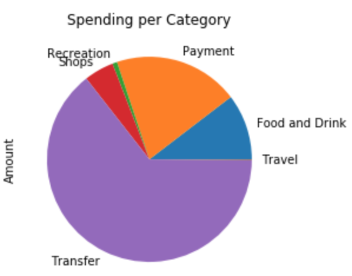
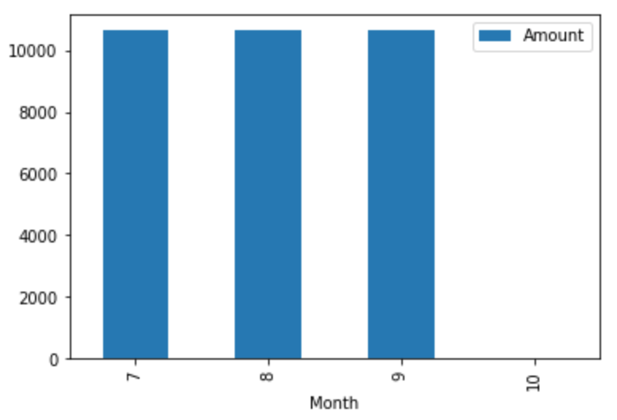
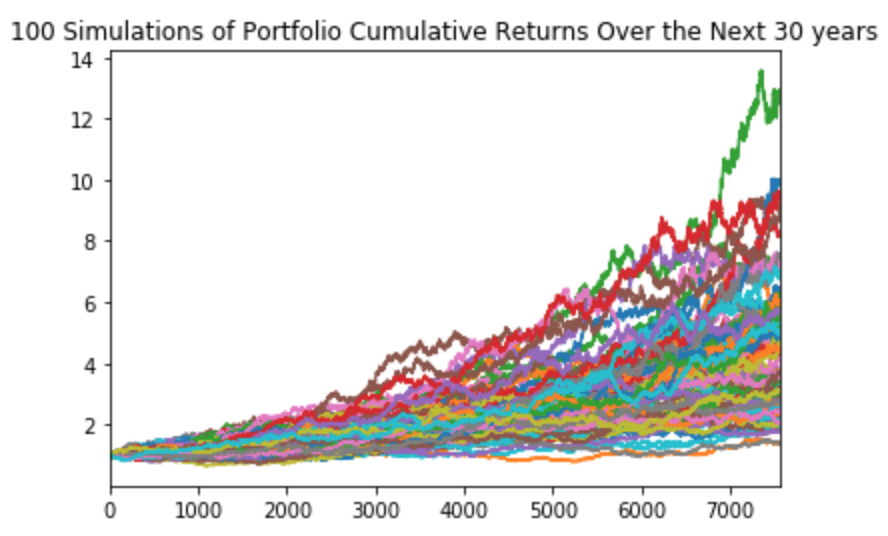

# Budget Analysis
* Most of the person's expense comes from the transfer category followed by payment and food and drink.

* On average, this person spends 10,000 dollars

# Retirement Planning

Red lines indicates 90% confidence intervals

Over 30 years, there is a 90% chance that the return falls between 210% and 890%.

Given a 20,000 dollar initial investment, 90% of time the end return is going to be greater than 46,305 dollars. If the person withdraws 4% of the portfolio return at 10th percentile, it's less than the projected annual income 6,085 dollars. Even if we increase the initial investment by 50%, at 4% withdraw, we still cannot meet the projected annual income. 
